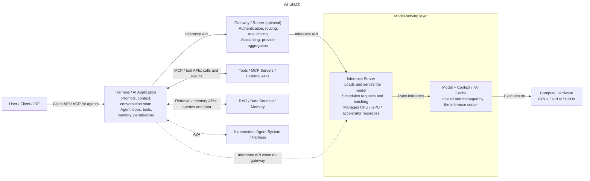

# AI Stack

A full AI stack combines a user-facing client, a harness / AI application, an optional gateway / router, and an inference server that hosts the model on compute hardware. The harness coordinates tools and data and sends model requests through the inference API.




## Stack Flow
A modern AI application might operate like this:

```
User sends prompt
 ↓
Harness / AI Application:
  •	manages the conversation, memory, and permissions
  •	constructs the model's context
  •	applies the system prompt
  •	provides tool descriptions and executes permitted tool calls
  •	retrieves information from RAG / data sources / memory
  •	performs context compaction
  •	manages agent loops
 ↓
Gateway / Router (optional):
  •	may authenticate, route, rate-limit, and account for requests
  •	may aggregate model providers
 ↓ Inference API (directly from the harness if no gateway)
Inference Server:
  •	loads and serves the model
  •	schedules requests and manages batching
  •	manages CPU/GPU/accelerator resources
 ↓
Model + Context / KV Cache (hosted by the inference server):
  •	processes tokens using context and inference-time cache
  •	performs reasoning
  •	generates responses, including requests to use available tools
 ↓ executes on
Compute Hardware: GPUs / NPUs / CPUs

Responses return through the inference server (and gateway, if used).
 ↓
Harness:
  •	executes permitted tool calls via MCP or other tool APIs
  •	receives tool results and retrieved data
  •	includes them as context in subsequent inference API requests
  •	presents the final response to the user
```
This distinction is important because an AI application's capabilities come from the combination of the model and the software surrounding it, rather than from the model alone.

The RAG / data connection in the diagram represents a retrieval pipeline rather than a property of the model. See [Retrieval-Augmented Generation Architecture](RAG.md) for its separate ingestion and query paths.

## Harnesses
A harness is the application layer around a model. It turns a user's request into model inputs, maintains conversation state, and decides what to do with the model's outputs. It assembles prompts and relevant context, manages agent loops and context compaction, and can retrieve data or make tools available to the model. When the model requests a tool call, the harness checks permissions, executes the call, and feeds the result back into a subsequent model request.

This separates application behavior from inference. The inference server runs the model and returns its output; the harness determines how that output becomes an action or a response to the user. A coding agent, for example, can use a harness to read files, run permitted commands, and present its work in an IDE. The interfaces below describe how the harness communicates with model servers, tools, clients, and other agents.

## Interfaces and Protocols

### Inference APIs
An inference API lets a harness or application request inference and receive results from a server, directly or through a gateway. These interfaces generally fall into two broad categories:

- **Task/application-oriented APIs** expose higher-level operations such as chat, text generation, embeddings, structured output, or classification. [OpenAI-compatible APIs](https://platform.openai.com/docs/api-reference/introduction) are a common example, with JSON requests over HTTP to endpoints such as `/v1/chat/completions` and `/v1/embeddings`. Supported endpoints and features vary by server.
- **Tensor/model-oriented APIs** expose model inputs and outputs more directly as typed, shaped tensors. They support generalized ML serving rather than a specific application workflow.


### Inference Serving Protocols
Serving protocols standardize how clients and servers exchange inference requests, results, and related metadata. KServe's V2 inference protocol / [Open Inference Protocol (OIP)](https://github.com/kserve/open-inference-protocol) defines tensor-oriented request and response schemas with HTTP/REST and gRPC interfaces. OpenAI compatibility instead refers to an API convention, commonly implemented using JSON over HTTP.

### Model Context Protocol (MCP)
[MCP](https://modelcontextprotocol.io/) is an open protocol that lets an AI application connect to external tools, data sources, resources, and prompt templates through MCP servers. The application (the MCP client) remains responsible for deciding which servers to connect to and enforcing permissions; MCP standardizes the interface, not trust or authorization.

After connecting to an [MCP server](Terminology.md#mcp-server), the client can discover its [tools](Terminology.md#tools), resources, and prompt templates. Client and server exchange structured messages, commonly over a local process's standard input/output or HTTP, so the harness can integrate these capabilities without a custom connector for each service.

For example, a coding agent's harness might discover a database-query tool and describe it to the model. If the model requests a query, the harness decides whether to allow the call, sends the arguments to the MCP server, and returns the result to the model as context for its next response. The model does not connect to the database directly. An MCP server's ability to read or change data depends on its own credentials and the permissions the client gives it, so servers and their exposed tools should be configured with care.

### Agent Client Protocol (ACP)
[Agent Client Protocol (ACP)](https://agentclientprotocol.com/) standardizes the interface between a coding agent and the application presenting it to a user, typically an editor or IDE. It lets an editor integrate different agents without building a separate UI integration for each one. The client owns the user-facing experience and controls access to its resources; the agent does the coding work.

ACP uses JSON-RPC messages: the client and agent first negotiate capabilities and any required authentication, then create or resume a session. The client sends a prompt, and the agent streams session updates such as text, tool activity, and progress; it can also ask the client for file or terminal access and request permission before sensitive actions. A local agent commonly runs as an editor subprocess over standard input/output, while remote transports are also being developed.

### Agent2Agent Protocol (A2A)
[Agent2Agent (A2A)](https://a2a-protocol.org/) standardizes collaboration between independent agents, potentially built with different frameworks or run by different organizations. A remote agent publishes an Agent Card describing its endpoint, skills, and authentication requirements. Another agent or application can use that card to choose a suitable agent and send it a message or task; the remote agent works independently without exposing its internal tools or reasoning. For longer jobs, the caller can follow task status, receive updates by streaming or polling, and collect output artifacts such as documents or structured data. Unlike MCP, A2A connects agents to agents, not agents to tools.

In practice, a calling agent discovers the remote agent's card, authenticates as required, and sends a request to its HTTP endpoint containing a message with text, files, or structured data. The remote agent can answer immediately or return a task ID for work that continues asynchronously. If it needs more information, the task can enter an input-required state; the caller responds with another message tied to that task. When the task completes, the caller retrieves its artifacts and uses them in its own workflow.

> **NOTE:**
>
> The earlier [Agent Communication Protocol (also abbreviated ACP)](https://agentcommunicationprotocol.dev/) addressed this same agent-to-agent interoperability problem and joined A2A under the Linux Foundation; it is ***not*** the Agent Client Protocol above. Agent Client Protocol connects an agent to its user-facing client (for example, an IDE), whereas Agent Communication Protocol and A2A connect independently operating agents to one another for delegation and collaboration.


## Inference Engines / Servers
An inference engine loads models, executes inference, manages accelerator memory, and batches and schedules requests. An inference server exposes the engine through an inference API, returning or streaming results. Products may combine these roles with model management and other convenience features.


## Serving / Orchestration Platforms
Serving and orchestration platforms deploy inference servers and manage their placement, scaling, health checks, rollouts, and routing across machines or clusters. Applications send requests to the deployed endpoints, optionally through a gateway for authentication, routing, rate limiting, and accounting; cluster schedulers allocate resources and launch processes outside this request path.

- Kubernetes-based deployments — containers, service discovery, and resource management for inference servers.
- Slurm/custom HPC deployments — GPU-node allocation and server launch, with additional integration for API routing and service lifecycle management.

For example, KServe can manage a vLLM deployment on Kubernetes:

```text
KServe / Kubernetes
        ↓
vLLM
        ↓
Model
        ↓
GPUs
```

In an HPC environment, the corresponding deployment might be:

```text
Slurm / cluster orchestration
        ↓
vLLM or another inference runtime
        ↓
Model
        ↓
GPU nodes
```

## Distributed Inference
A deployment can combine [model parallelism](Terminology.md#model-parallelism) within each instance with [data parallelism](Terminology.md#data-parallelism) across instances. For example, a service might run several replicas, each using [tensor parallelism](Terminology.md#tensor-parallelism) across a group of GPUs. Requests can be routed among replicas while each GPU group cooperates on its assigned work.

[Pipeline parallelism](Terminology.md#pipeline-parallelism) and [expert parallelism](Terminology.md#expert-parallelism) add placement considerations: layer groups and MoE experts must be distributed with enough memory, balanced work, and suitable connectivity. The combination depends on model architecture, runtime support, and cluster topology.

### Interconnects
When a single model spans multiple devices, accelerator-to-accelerator and node-to-node communication becomes part of inference execution. PCIe and NVLink/NVSwitch provide device connectivity within nodes; InfiniBand and high-speed Ethernet/RDMA can carry traffic between nodes. Depending on the parallelism strategy, model architecture, and hardware topology, distributed inference can become communication-bound. Adding devices therefore does not guarantee lower latency or proportional throughput gains.

### HPC Cluster Architecture
In an HPC deployment, model instances run on GPU nodes linked by the cluster interconnect. A single instance may span multiple nodes, or separate replicas may serve independent requests.

Cluster design depends heavily on the intended workload: interactive inference prioritizes responsiveness; high-throughput batch inference prioritizes aggregate work; long-context workloads increase prefill work and KV-cache pressure; and multimodal workloads add modality-specific processing and memory demands. Fine-tuning and [full model training](Terminology.md#training) are separate workloads with additional training state and communication requirements.
