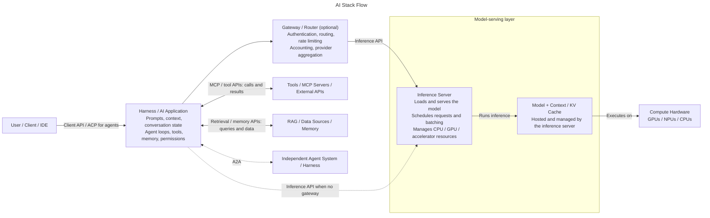

# AI Stack

A full AI stack combines a user-facing client, a harness / AI application, an optional gateway / router, and an inference server that hosts the model on compute hardware. The harness coordinates tools and data and sends model requests through the inference API.




## Stack Flow
A modern AI application might operate like this:

```
User sends prompt
 ↓
Harness / AI Application:
  •	manages the conversation, memory, and permissions
  •	constructs the model's context
  •	applies the system prompt
  •	provides tool descriptions and executes permitted tool calls
  •	retrieves information from RAG / data sources / memory
  •	performs context compaction
  •	manages agent loops
 ↓
Gateway / Router (optional):
  •	may authenticate, route, rate-limit, and account for requests
  •	may aggregate model providers
 ↓ Inference API (directly from the harness if no gateway)
Inference Server:
  •	loads and serves the model
  •	schedules requests and manages batching
  •	manages CPU/GPU/accelerator resources
 ↓
Model + Context / KV Cache (hosted by the inference server):
  •	processes tokens using context and inference-time cache
  •	performs reasoning
  •	generates responses, including requests to use available tools
 ↓ executes on
Compute Hardware: GPUs / NPUs / CPUs

Responses return through the inference server (and gateway, if used).
 ↓
Harness:
  •	executes permitted tool calls via MCP or other tool APIs
  •	receives tool results and retrieved data
  •	includes them as context in subsequent inference API requests
  •	presents the final response to the user
```
This distinction is important because an AI application's capabilities come from the combination of the model and the software surrounding it, rather than from the model alone.


## Protocols

### Model Inference Protocol (MIP)
A model inference protocol (MIP) defines how a client sends inputs to a deployed model and receives inference results, along with related information such as model selection, metadata, errors, and health status. **Tensor-oriented** protocols expose the model's low-level inputs and outputs directly as typed, shaped tensors (for example, arrays of token IDs, images, embeddings, or prediction scores), making them well suited to serving many model types and integrating with ML infrastructure. **Task-oriented** protocols instead expose a higher-level operation—such as chat completion, text generation, embeddings, or classification—and use request fields meaningful to that task. They are generally simpler for application developers, but less universal because the request and response schema is tied to the task rather than the model's raw tensor interface.

#### Tensor Oriented
- [Open Inference Protocol (OIP)](https://github.com/kserve/open-inference-protocol) — a standardized protocol for model inference, typically exposed over HTTP/REST or gRPC.
- [KServe V1 protocol](https://kserve.github.io/website/docs/concepts/architecture/data-plane/v1-protocol/) — the older KServe/KFServing prediction API, typically exposed over HTTP/REST or gRPC. OIP is essentially the successor to KServe V2, so V1 is the most direct alternative within the KServe ecosystem.
- [TensorFlow Serving API](https://www.tensorflow.org/tfx/guide/serving) — offers REST and gRPC prediction APIs, commonly using TensorFlow-specific request and response structures.
- [TorchServe Inference API](https://docs.pytorch.org/serve/) — HTTP-based APIs for predictions, model management, health checks, and metrics.
- [ONNX Runtime Server API](https://github.com/microsoft/onnxruntime) — commonly accessed through REST or gRPC interfaces, depending on the serving wrapper or deployment environment.

#### Task Oriented
- [OpenAI-compatible APIs](https://platform.openai.com/docs/api-reference/introduction) — a de facto JSON-over-HTTP interface, especially common for LLMs. Endpoints often resemble `/v1/chat/completions`, `/v1/completions`, and `/v1/embeddings`. This is an API convention rather than a formal general-purpose tensor-inference standard.
- [Custom REST APIs](https://restfulapi.net/) or [custom gRPC APIs](https://grpc.io/) — many production systems define their own schema over HTTP/JSON, gRPC/Protocol Buffers, or message queues such as Kafka.

### Model Context Protocol (MCP)
[MCP](https://modelcontextprotocol.io/) is an open protocol that lets an AI application connect to external tools, data sources, resources, and prompt templates through MCP servers. The application (the MCP client) remains responsible for deciding which servers to connect to and enforcing permissions; MCP standardizes the interface, not trust or authorization.

An MCP server acts as an adapter for a particular system, such as a filesystem, database, or service API. After the client connects, it can discover what the server offers: **tools** for taking actions, **resources** for reading data, and **prompts** for reusable interaction templates. Client and server exchange structured messages, commonly over a local process's standard input/output or HTTP, so the harness can integrate these capabilities without a custom connector for each service.

For example, a coding agent's harness might discover a database-query tool and describe it to the model. If the model requests a query, the harness decides whether to allow the call, sends the arguments to the MCP server, and returns the result to the model as context for its next response. The model does not connect to the database directly. An MCP server's ability to read or change data depends on its own credentials and the permissions the client gives it, so servers and their exposed tools should be configured with care.

### Agent Client Protocol (ACP)
[Agent Client Protocol (ACP)](https://agentclientprotocol.com/) standardizes the interface between a coding agent and the application presenting it to a user, typically an editor or IDE. It lets an editor integrate different agents without building a separate UI integration for each one. The client owns the user-facing experience and controls access to its resources; the agent does the coding work.

ACP uses JSON-RPC messages: the client and agent first negotiate capabilities and any required authentication, then create or resume a session. The client sends a prompt, and the agent streams session updates such as text, tool activity, and progress; it can also ask the client for file or terminal access and request permission before sensitive actions. A local agent commonly runs as an editor subprocess over standard input/output, while remote transports are also being developed.

### Agent2Agent Protocol (A2A)
[Agent2Agent (A2A)](https://a2a-protocol.org/) standardizes collaboration between independent agents, potentially built with different frameworks or run by different organizations. A remote agent publishes an **Agent Card** describing its endpoint, skills, and authentication requirements. Another agent or application can use that card to choose a suitable agent and send it a message or task; the remote agent works independently without exposing its internal tools or reasoning. For longer jobs, the caller can follow task status, receive updates by streaming or polling, and collect output **artifacts** such as documents or structured data. Unlike MCP, A2A connects agents to agents, not agents to tools.

In practice, a calling agent discovers the remote agent's card, authenticates as required, and sends a request to its HTTP endpoint containing a message with text, files, or structured data. The remote agent can answer immediately or return a task ID for work that continues asynchronously. If it needs more information, the task can enter an input-required state; the caller responds with another message tied to that task. When the task completes, the caller retrieves its artifacts and uses them in its own workflow.

> **NOTE:**
>
> The earlier [Agent Communication Protocol (also abbreviated ACP)](https://agentcommunicationprotocol.dev/) addressed this same agent-to-agent interoperability problem and joined A2A under the Linux Foundation; it is ***not*** the Agent Client Protocol above. Agent Client Protocol connects an agent to its user-facing client (for example, an IDE), whereas Agent Communication Protocol and A2A connect independently operating agents to one another for delegation and collaboration.


## Inference Servers
Inference servers are responsible for running the AI models and providing the inference API.

### Local Inference Servers
- [Ollama](https://ollama.com/)
- [llama.cpp](https://llama.app/)
- [vLLM](https://vllm.ai/)
- [NVIDIA Triton Inference Server](https://docs.nvidia.com/deeplearning/triton-inference-server/user-guide/docs/customization_guide/inference_protocols.html)
- [Seldon Core](https://docs.seldon.ai/seldon-core-1/configuration/deployments/servers/protocols)
- [MLServer](https://docs.seldon.ai/mlserver/)
- [OpenVINO Model Server](https://docs.openvino.ai/2025/model-server/ovms_what_is_openvino_model_server.html)


## All-in-one solutions & desktop apps
- [lmstudio](https://lmstudio.ai/)
- [localai](https://localai.io/)
- [unsloth](https://github.com/unslothai/unsloth)
- [jan](https://jan.ai/)
- [anythingllm](https://github.com/AnythingLLM/anythingllm)
- [lemonade-server.ai](https://lemonade-server.ai/)


## Agents & Harnesses

### Agentic Concepts
- Plugins
- Skills
- Tools
- .agents file
- Memory
