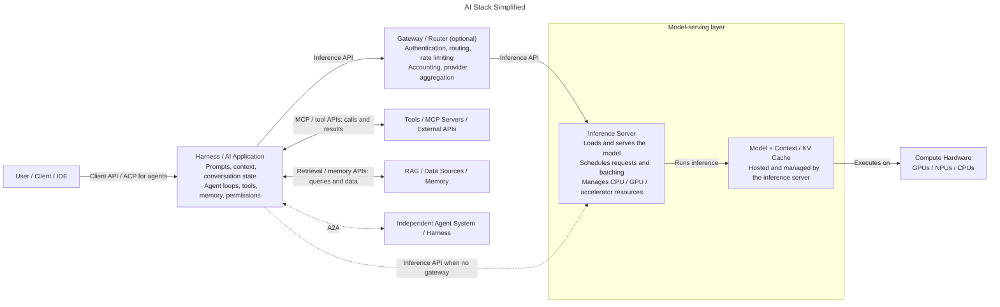

---
---


# AI Brown Bag

## A TLDR Intro to AI concepts, trends, buzzwords, and the state of the industry over a long lunch break or afternoon.

### By: Erick McGhee

<https://github.com/mcgheee/AI_02H_Course>


---


# Terms

- Harness - The application that allows users or other software to interact with AI models. 
- Agent - A special type of harness that operates on a loop.
- Context - What is stored in the model's working memory.
- Memory - Durable long term storage of data
- Prompt - A single instruction or question to the model.
- Turn - A single response in a conversation from either the client or the model.
- Inference - The process of generating a response from the model.


---


# Model Types

- LLMs
  - Ex: GPT 6, Claude 5, Grok 4
- Diffusion
  - Ex: Stable Diffusion, DALL-E, LTX
- Classification
  - Ex: Jev, Laya

---





---


# Application Workflow

```
User sends prompt
 ↓
Harness / AI Application:
  •	manages the conversation, memory, and permissions
  •	constructs the model's context
  •	applies the system prompt
  •	provides tool descriptions and executes permitted tool calls
  •	retrieves information from RAG / data sources / memory
  •	performs context compaction
  •	manages agent loops
 ↓
Gateway / Router (optional):
  •	may authenticate, route, rate-limit, and account for requests
  •	may aggregate model providers
 ↓ Inference API (directly from the harness if no gateway)
Inference Server:
  •	loads and serves the model
  •	schedules requests and manages batching
  •	manages CPU/GPU/accelerator resources
 ↓
Model + Context / KV Cache (hosted by the inference server):
  •	processes tokens using context and inference-time cache
  •	performs reasoning
  •	generates responses, including requests to use available tools
 ↓ executes on
Compute Hardware: GPUs / NPUs / CPUs

Responses return through the inference server (and gateway, if used).
 ↓
Harness:
  •	executes permitted tool calls via MCP or other tool APIs
  •	receives tool results and retrieved data
  •	includes them as context in subsequent inference API requests
  •	presents the final response to the user
```

---


# Harness

- Basically any app used to interact with AI
  - Web Chat
  - CLI
  - Agentic


---


# Inference Server

- Loads and serves the model
- Schedules requests and manages batching
- Manages CPU/GPU/accelerator resources


---


# Agents

- A type of Harness
- Operates on a loop until conditions are met
- May provide or connect to tools

> **Examples:** Openclaw, Hermes, OpenCode, Codex, Claude Code


---


# Tools

- May be provided by the harness
  - Ex: Read, Write, Execute
-  Or, connected to an external service via MCP
  - Ex: Web scraping, Memory, Computer Use


---


# Skills

- Provide instructions, **not** capabilities
- Written in natural language
- Usually structured in Markdown


---


# Context

- Model's working memory
- Limited in Size
- Lossy due to compaction


---


# Guardrails

- Constrains what a model can accept, produce, or do
- Soft constraints that guide the model's behavior
  - System / Developer Instructions, Training, Prompt
- Hard constraints that prevent action
  - Sandboxing, Permission Gating, Human Approval

```text
User
  │
  ▼
Input Guardrails
  │
  ▼
System / Developer Instructions
  │
  ▼
LLM
  │
  ├──► Tool / Action Guardrails ──► APIs, shell, email, files, etc.
  │
  ▼
Output Guardrails
  │
  ▼
User
```


---
