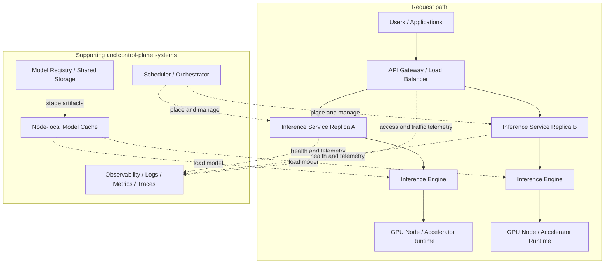

# HPC Inference Architecture

This document maps AI inference onto concepts familiar to an experienced HPC system administrator. It focuses on operating model-serving infrastructure. For definitions of model artifacts and runtime state, see [Model Properties](Model_Properties.md). For concise definitions of AI terms, see [Terminology](Terminology.md).

## Purpose and Workload Types

An AI cluster can host several workloads with different operational requirements:

- **Interactive inference** serves user or application requests and usually streams responses. Tail latency, availability, queue time, and time to first token matter alongside throughput.
- **Batch inference** processes a known collection of inputs. It can favor aggregate throughput and high utilization over the latency of an individual item.
- **Agent workloads** combine repeated inference calls with tools and external services. Request duration and resource demand can be irregular because one user task may produce many model calls with pauses between them.
- **Fine-tuning** updates some or all model weights for a particular purpose. It needs training data and additional memory for gradients, optimizer state, or adapter state.
- **Full training** creates or substantially trains a model at large scale. It has different storage, checkpointing, networking, and failure-recovery requirements from serving.

Interactive and batch inference can share hardware, but they should not automatically share scheduling policies. Fine-tuning and full training are included here only to distinguish their resource profiles. This is not a training-cluster design guide.

## Deployment Overview

The solid arrows in this diagram show the inference request path. Dotted arrows show deployment, artifact, and telemetry relationships that support the service but are not traversed by every request.



The gateway, inference service replicas, and engines may be separate processes or combined by one product. Likewise, a scheduler might launch a service without implementing its public API, authentication, or load balancing. Not every installation needs every box, especially a small single-node deployment.

## Hardware and Resource Considerations

### Accelerator memory and execution

GPU or accelerator **high-bandwidth memory (HBM) capacity** sets a hard limit on the model weights and runtime allocations that can reside on a device. HBM must hold more than the [model weights](Terminology.md#model-weights). It also holds the [KV cache](Terminology.md#kv-cache), temporary activations, communication buffers, and inference-engine workspaces. A checkpoint whose weights fit can therefore still exhaust memory under long contexts or high [concurrency](Terminology.md#concurrency).

**HBM bandwidth** is the rate at which the accelerator can move data to and from that memory. Autoregressive [decode](Terminology.md#decode) repeatedly reads weights and runtime state and is often bandwidth-sensitive at low batch sizes. **Accelerator compute capability** includes the supported data types and the throughput of the operations used by the model. It is especially important during compute-intensive [prefill](Terminology.md#prefill) and larger batches. An engine must support the particular architecture, quantization format, accelerator, and software runtime as a compatible combination.

[Quantization](Terminology.md#quantization) can reduce weight memory and may leave more HBM for the KV cache or additional requests. Its speed and quality effects depend on the format, model, engine, and hardware. Capacity estimates should use the exact artifact and representative requests rather than a parameter count alone. [Model Properties](Model_Properties.md#runtime-resource-properties) provides the weight-memory estimate and explains the other runtime allocations.

### Host resources and data paths

- **CPU resources** handle API processing, tokenization, request scheduling, preprocessing, and data movement. Multimodal inputs may add substantial CPU work unless processing is accelerated elsewhere.
- **System RAM** can stage model artifacts, support memory-mapped files, hold CPU-side model components, and buffer requests. Loading several workers at once can multiply peak demand.
- **Local storage** provides a fast node-local model cache and avoids repeatedly reading large artifacts from shared storage. Its capacity, persistence across jobs, eviction policy, and integrity controls affect restart behavior.
- **Model-loading bandwidth** is the effective rate across the entire path from registry or shared storage through the network and filesystem into host memory and HBM. The slowest shared component can dominate cold start.
- **PCIe** commonly carries data between CPU memory, NICs, and accelerators. Device placement and PCIe switch or NUMA topology can create contention even when headline link speeds appear sufficient.
- **NVLink and NVSwitch**, where available, provide higher-bandwidth accelerator-to-accelerator paths within a node or system. They are particularly useful when one inference instance communicates frequently across GPUs.
- **InfiniBand or high-speed Ethernet with RDMA** can carry collective and point-to-point traffic when an instance spans nodes. End-to-end performance also depends on NIC placement, transport support, routing, and contention.

Topology is a schedulable resource, not merely a hardware inventory detail. A group of four GPUs behind the same high-speed fabric may be more useful for [tensor parallelism](Terminology.md#tensor-parallelism) than four GPUs reached through slower or oversubscribed paths.

### Parallelism, concurrency, and batching

An inference engine coordinates [batching](Terminology.md#batching), request scheduling, accelerator memory, and model execution. Interactive serving often uses continuous batching to combine active sequences without waiting for every sequence in a batch to finish. Greater batching and concurrency can raise aggregate utilization, but consume more KV-cache capacity and can increase queueing, time to first token, or inter-token latency.

When a complete replica does not fit on one accelerator, operators can use forms of [model parallelism](Terminology.md#model-parallelism):

- [Tensor parallelism](Terminology.md#tensor-parallelism) divides layer operations and requires frequent device communication.
- [Pipeline parallelism](Terminology.md#pipeline-parallelism) places successive stages on different devices and passes intermediate values between them.
- [Expert parallelism](Terminology.md#expert-parallelism) distributes experts in a Mixture-of-Experts model and communicates routed token representations.
- [Data parallelism](Terminology.md#data-parallelism) runs replicas for different requests. Each replica can itself use one of the model-parallel approaches above.

These strategies trade memory capacity, computation, communication, and scheduling complexity. They do not make all GPUs interchangeable.

## Model Loading and Caching

A typical model-loading lifecycle is:

```text
Model registry or controlled artifact storage
        ↓ download, verify, and stage an approved revision
Shared filesystem, object storage, or node-local cache
        ↓ read model artifacts
Host memory and inference runtime
        ↓ initialize and transfer weights
GPU HBM
        ↓ allocate runtime state and complete health checks
Inference service ready
```

The files and metadata in this path are [model artifacts](Terminology.md#model-artifact), not a running model service. They can include sharded weights, model configuration, tokenizer files, generation configuration, and implementation-specific assets. See [What Gets Deployed](Model_Properties.md#what-gets-deployed) for details.

Large artifacts make service startup operationally significant. Simultaneous cold starts can saturate a registry, object store, metadata server, or cluster network. A persistent node-local cache reduces repeated transfers, but it needs capacity management, revision-aware keys, integrity checking, and a policy for stale data. Shared filesystems simplify distribution while creating shared bandwidth and metadata dependencies. Object storage can scale distribution differently, but still needs a local staging or streaming design supported by the runtime.

A process restart might reuse the local files yet still have to reconstruct the engine and reload weights into HBM. A replacement on another node may incur the full download. Health checks should not advertise readiness until loading and required initialization are complete. Because cold start may take much longer than starting an ordinary stateless web process, reactive autoscaling alone may not satisfy interactive latency targets. Warm replicas, reserved capacity, cache-aware placement, and controlled rollout rates can be more practical.

## Long-Running Services Versus Traditional HPC Jobs

A conventional HPC job usually has a bounded lifecycle:

```text
Allocate resources
→ run computation
→ write results
→ exit
→ release resources
```

Interactive inference has a service lifecycle:

```text
Allocate GPU resources
→ load a large model
→ expose a long-lived service
→ accept variable concurrent requests
→ maintain runtime and KV-cache state
→ continuously batch and schedule requests
```

The service must be discoverable while its allocation is active. It also needs readiness and liveness decisions, graceful draining, request routing, failure recovery, access controls, and telemetry. Demand varies while the resource allocation remains fixed or changes relatively slowly. Reclaiming an allocation destroys in-memory request and KV-cache state and usually requires another expensive model load later.

This mismatch affects cluster design. A batch scheduler is effective at placing resources and enforcing allocation policy, but an interactive service also needs mechanisms for stable endpoint discovery and continuous traffic management. Queue wait time, wall-time limits, planned maintenance, node failure, and preemption become user-visible availability concerns. Mixing service allocations with queued batch jobs also requires an explicit policy for reservations, priorities, and utilization goals.

## Slurm-Based Serving

Slurm can allocate GPU nodes and launch an inference engine as a long-running job or step. A submission wrapper can select the model revision and resources, stage artifacts, start the server, and publish its healthy endpoint. Slurm remains responsible for allocation and process launch according to site policy. The inference engine remains responsible for loading and executing the model, managing HBM, and scheduling model work.

A usable service normally requires components around Slurm:

- **Service discovery and endpoint registration** map a logical service name to the nodes and ports in the current allocation.
- **Ingress and load balancing** provide a stable client address and distribute traffic across replicas.
- **Health checks** prevent traffic from reaching processes that are loading, draining, or failed.
- **Authentication and authorization** establish who may call an endpoint and which model or tenant they may use.
- **Lifecycle management** submits replacements, reacts to job termination, drains replicas, and removes stale registrations.
- **Observability** collects request, engine, accelerator, job, and artifact-loading signals.

These are architectural responsibilities, not features implied merely by using Slurm. Sites can implement them with existing infrastructure services, custom integration, or a serving layer. A direct connection to a compute-node port may be useful for a controlled experiment, but it does not by itself provide a production service boundary.

## Kubernetes-Based Serving

Kubernetes schedules containers onto nodes and provides primitives for services, health probes, configuration, credentials, and controllers. GPU device plugins and related operators make accelerator resources visible to scheduling. A model server still runs inside the allocated container or pod and performs inference.

Serving platforms build on those primitives. [KServe](https://kserve.github.io/website/docs/model-serving/generative-inference/overview) provides Kubernetes resources and controllers for deploying and managing model-serving workloads. [Ray Serve](https://docs.ray.io/en/latest/serve/) provides a programmable serving layer on Ray for composing and scaling model-serving applications. [Red Hat OpenShift AI](https://docs.redhat.com/en/documentation/red_hat_openshift_ai_self-managed/) and [Open Data Hub](https://opendatahub.io/) package model-serving capabilities into broader AI platforms. Exact supported runtimes and integration features change, so deployment decisions should use the documentation for the installed release.

These platforms are not substitutes for the inference engine. A representative layering is:

```text
KServe
    ↓ declares and manages a serving workload
Kubernetes
    ↓ places and operates pods and services
vLLM
    ↓ loads artifacts and executes inference
Model artifacts and runtime state
    ↓ execute through the accelerator software stack
GPU
```

The layers may be packaged together in a distribution, but their responsibilities remain different. Kubernetes or a serving controller handles desired state and placement. An engine such as vLLM handles model execution, memory, and inference-oriented request scheduling. A gateway can remain a separate entry point for authentication, quotas, and routing.

## Distributed Inference

A model may span GPUs because its weights and runtime state do not fit on one device, or because the operator needs more compute and bandwidth for a latency or throughput target. It may span nodes when a single node lacks enough attached accelerator memory. Both cases place communication inside the inference execution path.

For example, two replicas can each use tensor parallelism across four GPUs:

```text
                       ┌─ Replica 1 ───────────────────────┐
Client → Load balancer ├→ GPU 0 ─ GPU 1 ─ GPU 2 ─ GPU 3  │
                       │       tensor parallel group       │
                       └────────────────────────────────────┘
                       ┌─ Replica 2 ───────────────────────┐
                       ├→ GPU 4 ─ GPU 5 ─ GPU 6 ─ GPU 7  │
                       │       tensor parallel group       │
                       └────────────────────────────────────┘
```

The load balancer assigns requests between replicas. Within a replica, the GPUs cooperate on each request. The serving system should route only to complete, healthy groups rather than treating each GPU as an independent endpoint.

Adding GPUs does not guarantee linear scaling. Collective communication, pipeline bubbles, uneven expert routing, synchronization, small batches, CPU bottlenecks, and topology can offset added compute. Multi-node operation adds network latency and failure domains. Benchmark the intended model, engine, parallel layout, prompt and output lengths, and concurrency on the intended topology.

## Production Operational Concerns

Production operation requires measurements at the user, service, engine, and resource layers:

- **Health and readiness:** distinguish a live process from a replica that has loaded the correct model and can accept traffic. Include draining and partial distributed-replica failures.
- **Request latency:** measure end-to-end percentiles as well as averages. Separate queue time from execution time where possible.
- **TTFT and ITL:** [time to first token](Terminology.md#time-to-first-token-ttft) exposes queue and prefill delay. [Inter-token latency](Terminology.md#inter-token-latency-itl) describes streaming cadence after the first token.
- **Aggregate throughput:** track completed requests and prompt and output tokens per unit time. Interpret them with request lengths and latency objectives.
- **Concurrency and queue depth:** show active demand and pending work. A growing queue can precede timeouts even when GPU utilization looks high.
- **GPU and HBM utilization:** show whether accelerators execute useful work and how close memory use is to capacity. Neither metric alone proves good service performance.
- **Errors and loading failures:** distinguish invalid requests, overload rejection, engine failures, out-of-memory events, missing artifacts, integrity failures, and registry or storage errors.
- **Capacity planning:** test representative context lengths, output lengths, parallel layouts, batch policies, and service-level objectives. Keep headroom for failures and maintenance.
- **Admission control and quotas:** bound request size, context length, generated tokens, concurrency, and tenant consumption before overload damages all users.
- **Multi-tenancy:** decide whether tenants share replicas, nodes, caches, networks, and credentials. Isolation requirements can reduce theoretical utilization.
- **Logging and tracing:** correlate a request through gateway, queue, replica, model revision, and tool or retrieval calls without recording sensitive prompts by default.

Dashboards and alerting products are implementation choices. The architectural requirement is enough correlated information to distinguish demand, queueing, model execution, artifact loading, hardware, and downstream failures.

## Security

An inference endpoint is a network service that consumes scarce resources and may process sensitive data. Apply familiar controls:

- RBAC and independently enforced authorization for model, operation, and tenant access.
- Scoped service credentials rather than shared cluster-wide credentials.
- Network segmentation among public ingress, service replicas, management systems, and storage.
- Secret storage and rotation outside images, model repositories, prompts, and logs.
- Tenant isolation appropriate to the data and threat model.
- API authentication, rate limits, quotas, and maximum request sizes at a trusted boundary.
- Audit logs for administrative actions, model revisions, access decisions, and credential use.

Model instructions are not an access-control mechanism. Conventional controls must determine what a user, service, or agent may access. [Guardrails](Guardrails.md) explains defense in depth, deterministic enforcement, sandboxing, and human approval in more detail.

## Design Questions for an HPC Site

Before choosing products, identify the responsibilities the deployment must satisfy:

1. Which workload classes and latency objectives will the cluster support?
2. Which exact model artifacts, context lengths, and concurrency levels must fit?
3. Does one replica fit on one GPU, one node, or multiple nodes?
4. Where are approved artifacts stored, and how are revisions verified and cached?
5. What allocates resources, and what keeps the long-running endpoint registered and healthy?
6. What is the stable client entry point, and where are identity, quotas, and admission enforced?
7. Which signals show whether a slowdown comes from queueing, prefill, decode, communication, or loading?
8. How are replicas drained, replaced, and recovered without sending requests to an unready model?

Keeping these responsibilities separate makes it easier to evaluate a Slurm integration, a Kubernetes serving platform, or a smaller custom deployment without confusing the scheduler, inference engine, model, and application layers.
