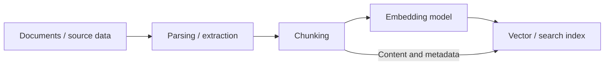
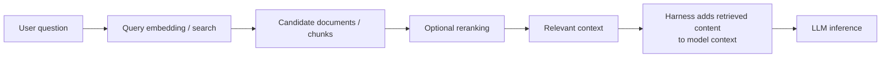

# Retrieval-Augmented Generation Architecture

[Retrieval-Augmented Generation (RAG)](Terminology.md#rag-or-retrieval-augmented-generation) is an application architecture that retrieves external information and supplies selected content to a generative model at inference time. It is primarily software surrounding the model. A typical RAG workflow does not modify the model's weights.

RAG has two broad paths. The ingestion and indexing path prepares source material for search. The query path searches that prepared collection and adds relevant results to a model request. They can run as separate services and on different schedules.

## Ingestion and Indexing Path

1. **Documents or source data** enter from approved systems such as file repositories, object storage, databases, or web content.
2. **Parsing and extraction** turn each source format into usable text and metadata. Scanned documents may require optical character recognition. Tables and document structure may require format-specific processing.
3. **[Chunking](Terminology.md#chunking)** divides content into retrieval units. A chunk should be small enough to search and fit into a model context, but large enough to retain the surrounding meaning. Chunk boundaries, overlap, headings, and source type affect retrieval quality.
4. An **[embedding model](Terminology.md#embedding-model)** converts each chunk into an [embedding](Terminology.md#embeddings). The embedding is a numeric representation used for similarity comparison. It is not a copy or summary of the source.
5. A **[search index](Terminology.md#vector-index)** stores searchable representations. A vector index stores embeddings for similarity search. The system also needs the source text or a reference that can retrieve it, plus metadata such as document identity, owner, timestamps, classification, and access scope.

Indexing is an operational lifecycle rather than a one-time import. Changed or deleted source documents need corresponding index updates. Operators also need to track which parser, chunking policy, and embedding-model version produced an entry. Replacing an embedding model normally requires rebuilding the affected vector index because vectors from different models are not necessarily comparable.

## Query Path

1. The application receives a question together with the user's identity, tenant, and other request metadata.
2. The retrieval component searches for candidate documents or chunks. For vector search, it embeds the query with a model compatible with the indexed embeddings and finds nearby vectors. Full-text search instead matches lexical terms. Hybrid retrieval combines methods so that semantic similarity does not have to replace exact keyword matching.
3. **[Metadata filtering](Terminology.md#metadata-filtering)** narrows eligible results using fields such as tenant, repository, document type, date, or classification. Filtering may occur before or during search depending on the retrieval system.
4. An optional **[reranker](Terminology.md#reranking)** scores a smaller candidate set more precisely against the original question. Reranking can improve ordering, but adds latency and compute cost.
5. The application selects relevant text within its context and token budgets. It can attach source identifiers or links so that the answer can identify its evidence.
6. The [harness](Terminology.md#harness) places the selected content into the model's context, usually with instructions describing how it should be used. The harness then sends the assembled request to the inference service.
7. The model generates an answer from its existing weights and the supplied context. The retrieved material influences this inference request only. It does not become part of the model's trained weights.

Retrieval and generation are distinct operations. A successful search can still supply irrelevant, outdated, misleading, or contradictory material. The model can also fail to use good evidence correctly. Systems should therefore retain source references, expose uncertainty where appropriate, and evaluate retrieval quality separately from answer quality.

## Search Components and Their Boundaries

**Vector search** ranks records by the similarity of their embeddings. It is useful when relevant passages use different words from the question. Search implementations commonly use approximate nearest-neighbor indexes to avoid comparing a query with every stored vector. That implementation detail trades resource use, search latency, and recall, but does not change the role of retrieval in the architecture.

A **vector index** is the data structure used to perform vector search. A **vector database** is a database or service that stores vectors and associated records and provides indexing, filtering, update, and query operations. The terms are sometimes used loosely, but neither is synonymous with RAG. They implement one possible retrieval layer.

RAG can retrieve from traditional full-text search, a relational or document database, a knowledge graph, an external search service, or an application API. It can also combine lexical and vector results in hybrid search. The defining behavior is that the application retrieves external information and supplies it to generation, not that it uses a particular database type.

## Grounding and Source Handling

**[Grounding](Terminology.md#grounding)** connects an answer to supplied evidence. In a RAG system, the retrieved passages are grounding material. Prompt instructions can ask the model to answer only from that material and cite its sources. This can reduce unsupported answers, but it is not a deterministic guarantee that every generated statement is supported.

Source content is untrusted input even when it comes from an internal repository. It may contain inaccurate text or instructions aimed at the model. The harness should clearly separate retrieved data from application instructions, constrain any actions that follow, and apply the controls described in [Guardrails](Guardrails.md).

## Authorization and Tenant Isolation

Retrieval must enforce the source system's authorization rules. A user who cannot read a document must not gain access to it because its chunks appear in search results or model context. Authentication at the chat interface or inference API is not sufficient by itself.

Common designs attach access-control metadata to indexed records and filter every query using the caller's current identity and entitlements. Another design performs retrieval through the source system under scoped user or service credentials. Both require attention to revocation and index freshness. A copied chunk can remain retrievable after source permissions change unless the retrieval system updates or revalidates access.

Authorization should be enforced before content enters the model context. Asking the model to hide unauthorized results is not an access-control boundary. Multi-tenant deployments should also prevent cross-tenant leakage through caches, logs, traces, stored prompts, and retrieval indexes.

## Operational Implications

- **Capacity:** Document count, chunk size, overlap, vector dimensions, metadata, and replicas determine index and storage requirements.
- **Latency:** Query embedding, search, reranking, source fetching, and LLM inference each contribute to end-to-end latency.
- **Context use:** Retrieved chunks consume the model's finite [context window](Terminology.md#context-window). Supplying more candidates can increase prefill work and can make useful evidence harder for the model to identify.
- **Freshness:** Source updates, deletion, permission changes, and reindexing need observable workflows with retry and failure handling.
- **Evaluation:** Retrieval recall and ranking should be measured separately from faithfulness and answer quality. A generation failure and a retrieval failure require different remediation.
- **Provenance:** Source identifiers, revisions, ingestion time, and processing versions help operators explain an answer and rebuild an index reproducibly.

The result is an application pipeline with its own storage, compute, security, and lifecycle requirements. The language model is one component in that pipeline, not the entire RAG system.
