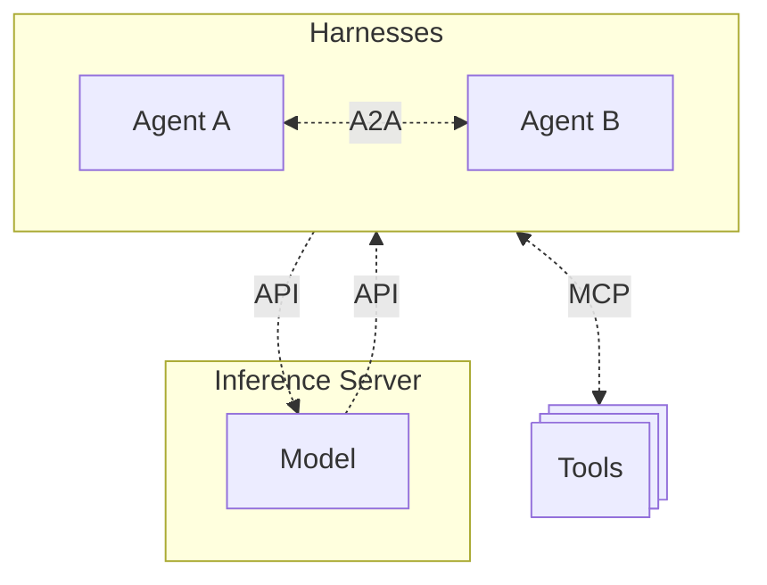
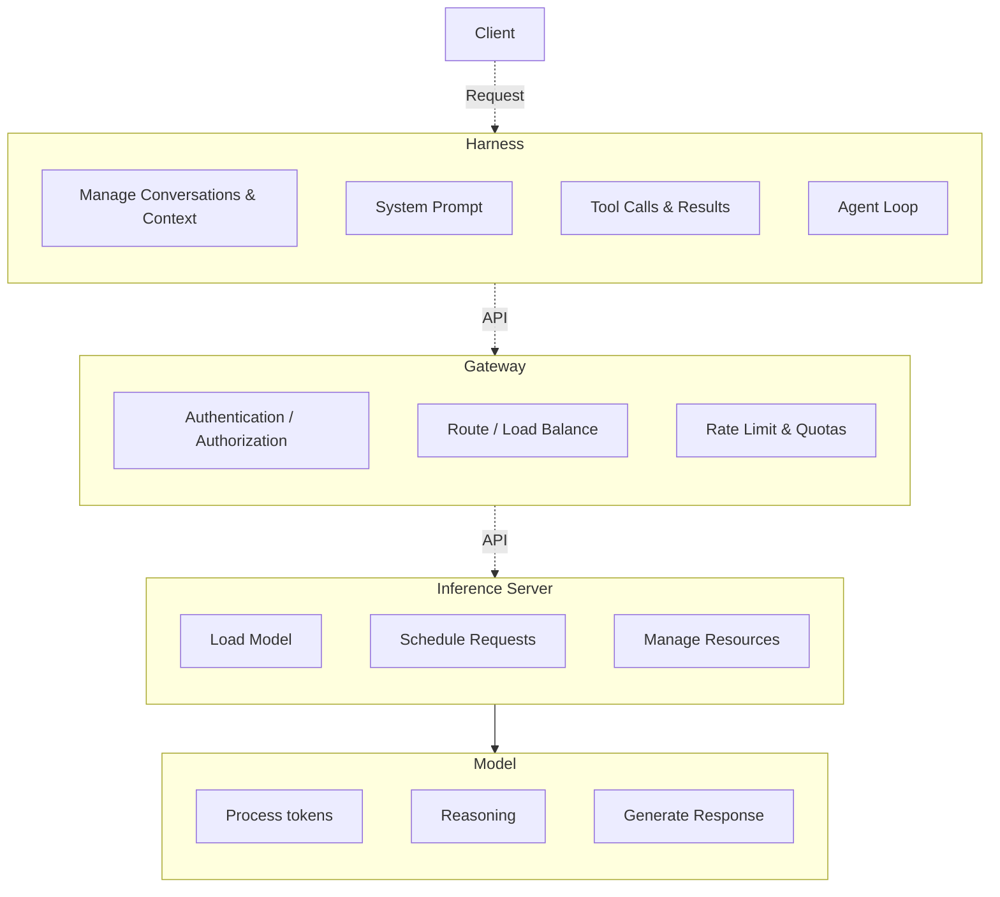

# AI CyberInfrastructure Introduction
The world of AI is moving fast. So fast, it's nearly impossible to keep up. Every day you hear about new models, new features, new concepts, new buzzwords. You could spend your entire day watching YouTube videos, reading articles and papers, or listening to podcasts and still not keep up. Not only that - if you don't keep up, you're going to be left behind. That's the idea that seems to be bandied about online, anyways. The truth is a little bit more nuanced, in favor of the everyday person that doesn't spend every waking hour hanging off the words of the AI Bro influencers. The field may be advancing as fast as they say, but that also means that what was yesterday's state of the art is today's obsolecense. What that means for you is that you're not actually that far behind. Right now is always the right time to start learning. Additionally, while the models are evolving & the harnesses are gaining features, the cyberinfrastructure behind it all is moving at a slower pace. While the frontier labs are striving for AGI & Devs are trying to earn GitHub stars, the servers and software that all this runs on aren't getting the same sort of attention. If you are a SysAdmin or HomeLabber, that just needs a nudge in the right direction, this course is for you.

## Terminology
First, we need to make sure everyone is on the same page with the terminology. If you go into a conversation with someone in the field and start referring to that "You are a..." statement you wrote 6 months ago as an 'agent', you're going to get the same look as those out of touch parents that call every video game console an X-Box. Let's start at the basics. The software you interact with be it a web chat GUI or a CLI TUI, is a harness. ChatGPT's website? Harness. Claude Code? Harness. Grok Bot? Harness. This is also where most of the features that make headlines are currently being made. So, what is an agent? An agent is a harness that works on a loop until a goal or condition is met; Meaning you don't have to continually prompt it to take every step. This could be something as complex as OpenClaw, or a small python script - the important part being that it works on a loop. While we're talking about prompts - a prompt is a command or instruction given to a model to perform a task. Your interactions with a model are called turns. Like taking turns in a conversation, each person gets one. You speak, the bot replies, you each took one turn. These are some of the most misused terms in the AI space.

## AI Stack Simplified
Now that we're speaking the same language, let's move on to architecture. At the highest level, an AI stack is made up of: a harness, an infererence server, and a model. An inference server is the software that actually runs the model, and serves it to the harness. Harnesses communicate the inference server via an MIP (Model Inference Protocol). In the case of LLMs, tends to be an API. The harness can connect to other software via MCP (Model Context Protocol). Software such as data loaders, vector databases, and other tools sit behind an MCP server. When connected to the harness, it makes those tools available to the model. Finally, different harnesses can communicate with each other via ACP (Agent Communication Protocol). This could allow you to call your coding agent from inside of an IDE.

## AI Application Workflow

