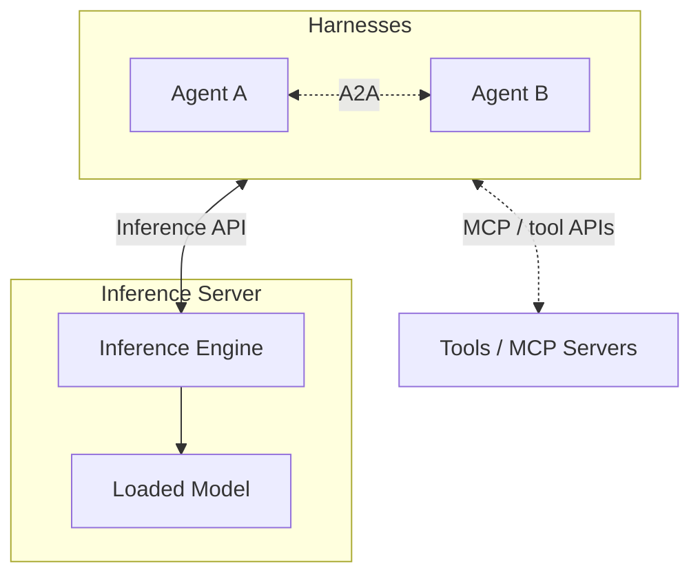
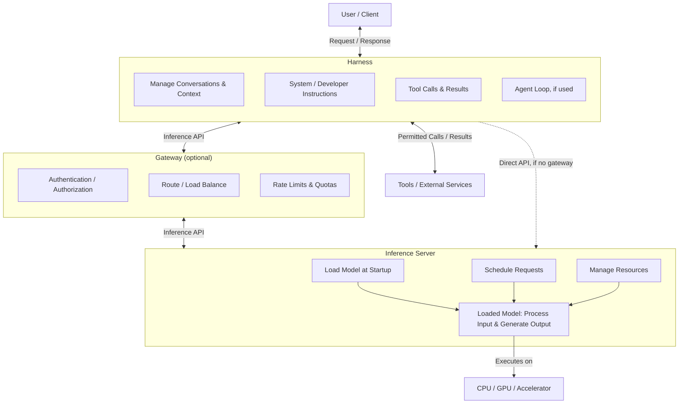

# AI CyberInfrastructure Introduction

This lecture introduces the infrastructure and application components used to run AI systems. We will look at how models, inference servers, harnesses, tools, and data sources fit together, with an emphasis on what matters when deploying and operating them. At the end, we will touch on security and recent trends in the field.

Models and applications are changing quickly, but many of the underlying infrastructure concepts remain familiar. Systems administrators and homelab operators still need to manage compute resources, storage, networking, permissions, and service availability. Understanding these responsibilities makes it easier to evaluate new products without treating each one as an entirely new stack.

This document accompanies the [slides](Slides/Slides.md). The slides provide an overview; the sections below explain the components and their relationships in more detail.

## Terminology

An AI application's interface, model, and surrounding software are different parts of the system. We will use the following terms throughout the course:

- **Harness:** The application layer around a model. It assembles model requests, manages conversation state, and determines how model output becomes a response or action. Web chat applications, command-line assistants, and IDE integrations can all provide harness functionality. ChatGPT's website and Claude Code are applications, not the models themselves.
- **Agent:** A system that uses a model and a harness to perform actions within a loop in pursuit of a goal. The harness repeatedly supplies context, processes model output, and executes permitted actions until the task is complete or a stopping condition is reached. This can be implemented by an application such as OpenClaw or by a small script. A persona instruction alone does not make a workflow agentic.
- **Prompt:** Input supplied to a model, often a question or task instruction. The complete model request may also contain application instructions, conversation history, tool descriptions, and other context.
- **Turn:** An interaction within a conversation. It commonly means a user message and the assistant response that follows it, though some APIs use the term for a single model invocation. Check how the application defines it.
- **Context:** The information available to the model for the current request. Calling it working memory is an analogy, not a description of a persistent database inside the model.
- **Memory:** Information the application stores durably and can retrieve for later requests or sessions.
- **Inference:** Running a trained model to produce an output. Generating a chat reply, producing an embedding, and classifying an email are all inference tasks.

See [Terminology](../../Reference/Terminology.md) for additional definitions.

## AI Stack Simplified

At a high level, an AI stack combines a harness, an inference server, and a model running on compute hardware. The harness coordinates the application workflow. The inference server exposes an API, while its inference engine executes the model through software runtimes, libraries, and drivers on CPUs, GPUs, or other accelerators. These are logical responsibilities, not necessarily separate processes or machines. A local application may combine several of them.

The interfaces between components serve different purposes:

- **Inference APIs** let the harness request model execution and receive results. OpenAI-compatible APIs using JSON over HTTP are common for LLM applications, but supported endpoints and features vary by server. Tensor-oriented interfaces, such as KServe's V2 inference protocol / Open Inference Protocol, support a different serving interface from a chat API.
- **Model Context Protocol (MCP)** lets an application discover and use tools, resources, and prompt templates exposed by an MCP server. A server may provide access to a database or external service. The harness decides which calls are permitted, invokes them, and returns results to the model. Tools can also be built into the harness or accessed through ordinary APIs; MCP is not required.
- **Agent Client Protocol (ACP)** connects a coding agent to a user-facing client, such as an editor or IDE.
- **Agent2Agent Protocol (A2A)** supports communication and delegation between independently operating agents.

> **Note: ACP Naming**
>
> The earlier Agent Communication Protocol was also abbreviated ACP and joined A2A. It is not the Agent Client Protocol used to connect coding agents to editors. See [AI Stack](../../Reference/AI_Stack.md#interfaces-and-protocols) for more information about these interfaces.

## Model Anatomy

A model is not normally deployed as one self-contained executable. For a text model, the main components to recognize are its configuration, tokenizer, and weights:

- **Configuration:** Structural settings needed to instantiate the model, such as its architecture identifier, layer dimensions, and vocabulary size. The inference engine needs a compatible implementation of the architecture.
- **Tokenizer:** Converts text into token IDs and generated IDs back into text. A token may represent a word, part of a word, punctuation, or whitespace; it is not a fixed number of characters. The tokenizer and chat formatting must match the checkpoint's expectations.
- **Weights:** The learned parameter values used by the architecture. Weight files generally account for most of the download and a significant portion of runtime memory. They do not contain the current conversation history.

A model repository may also include generation defaults, preprocessing files, a model card, and a license. Together, these files are **model artifacts**. A **checkpoint** is a saved model state from training or fine-tuning. In deployment discussions, it often refers to a released set of weights and the configuration needed to load them. A model family name alone does not identify the exact checkpoint or artifact variant.

A hub such as Hugging Face Hub distributes model artifacts; downloading them does not mean the hub is running inference for you. Before deploying a model, check its revision, license, architecture support, and weight format against the selected runtime. See [Model Properties](../../Reference/Model_Properties.md) for more information about artifacts and resource requirements.

## Model Types

Different models serve different tasks. The following categories are useful for understanding the stack, but they are not mutually exclusive:

- **Large language models (LLMs):** Generate text and code, commonly by predicting the next token. GPT, Claude, Grok, and Qwen are model families rather than names for the entire application stack. Some models also accept images or audio and are described as multimodal.
- **Diffusion models:** Commonly generate images, video, or audio through iterative denoising. Stable Diffusion is one example. Similar outputs do not establish that two generators use the same architecture.
- **Classification / decision models:** A classifier assigns labels or scores, such as “spam” or “not spam.” A decision model recommends or selects an action, such as whether to approve a transaction. Classification can inform a decision, but a label and an action are different outputs.
- **Embedding models:** Convert text or other inputs into numeric vectors used for similarity comparison. EmbeddingGemma is one example. These models support tasks such as semantic search rather than generating a conversational answer.

Model selection starts with the workload. Classifying a log entry may not require a large generative model. Searching documentation may use an embedding model and a retrieval system, with a separate LLM generating the final answer.

## Inference Server

An inference server loads and serves models, schedules requests, manages batching, and uses the available compute resources. More precisely, the **inference engine** handles model execution and runtime state, while the **server** exposes those capabilities through an API. Products often combine both roles. vLLM and llama.cpp are examples of projects that provide inference engines and server interfaces.

For an LLM, **prefill** processes the input prompt, while **decode** generates subsequent tokens. **Batching** lets an engine process work from multiple requests together. **Continuous batching** allows requests to join and leave the active batch as work progresses. These policies can improve aggregate throughput, but increased concurrency also consumes memory and can increase latency for individual requests.

Capacity planning must account for more than model weights. Runtime state, including the **KV cache** used by many LLMs to reuse attention computations, requires additional memory. A model whose weights fit in GPU memory may still exceed capacity under long-context or highly concurrent workloads.

A cluster scheduler such as Kubernetes or Slurm can place and launch the service. The inference engine still schedules model work within the running instance. These are separate scheduling responsibilities.

## Harness

A harness is the application used to interact with a model. It may provide a web chat interface, a CLI, an IDE integration, or a workflow interface such as ComfyUI. It receives the user's request, assembles the model input, sends it to an inference endpoint, and processes the result.

Conversation history, system instructions, tools, permissions, memory, and much of the user experience are managed at this layer. The same model can behave differently in two harnesses because each application supplies different context and capabilities. Changing the model does not by itself add file access, web search, or command execution.

## Agents

An agentic workflow adds a loop around model interaction. The harness supplies the task and relevant context, the model responds or requests an action, and the harness executes any permitted call. Its result becomes context for the next model request. The loop ends when the task is complete, a limit is reached, or a person needs to make a decision.

A coding agent, for example, might read a file, edit it, run a test, and revise the change based on the result. OpenClaw, Hermes, OpenCode, Codex, and Claude Code are examples of agentic applications; they are not interchangeable names for the models behind them.

Tool-call, time, and cost limits help prevent unproductive loops. Approval gates keep high-impact actions under human control. An agent can also delegate bounded tasks to subagents, which may help with independent work. Delegation adds resource use and requires coordination, especially when multiple agents can edit shared files. See [AI Agents](../../Reference/AI_Agents.md) for more information.

## Tools

Tools give an application ways to inspect information or act outside the model. Built-in tools may read files, write changes, or execute commands. Other tools may provide web search, database queries, memory access, or computer use through MCP or another API.

The model selects a tool and supplies arguments, but the harness executes the call and returns its result as context. A generated statement that a file was read is not evidence of file access; the tool call and its result establish what the application actually did.

A tool's reach depends on its implementation, credentials, and permissions. A database tool using a read-only account cannot write through that account even if the model requests it. Conversely, instructions to use an administrator credential carefully do not replace an enforced permission boundary.

## Skills

A skill provides reusable instructions for how to approach a task using available tools. It does not grant capabilities or permissions. A code-review skill might instruct an agent to inspect a diff, identify security issues, and run relevant tests. Repository access and test execution still depend on the harness exposing and permitting those tools.

Skills are commonly written in Markdown. A `SKILL.md` file may contain a name, description, and workflow instructions, with supporting templates or scripts where needed. Discovery and loading behavior depend on the harness.

Skills make repeatable processes easier to maintain without including the full procedure in every user prompt. They can describe project conventions, requirements, validation steps, and expected outputs, even when the model can perform the general task without detailed guidance.

## Context & Memory

Context is the model's working material for the current request. It can include system instructions, conversation history, tool descriptions, tool results, retrieved documents, and the user's message. The **context window** limits how much can fit, usually including a budget for generated output. A large context window does not guarantee that every supplied detail will be used correctly.

When a conversation becomes too long, the harness may **compact** it by summarizing older messages or removing material. Compaction is handled by the surrounding application and can lose details or introduce errors. Important facts should be checked against their source rather than relying only on a conversation summary.

Durable memory is separate from the current context. It may use Markdown files, task logs, a relational database, or a retrieval system. Stored information must be discovered and included in a later request to influence the model. Memory also needs access controls and rules for updates and deletion, since saved information can become stale or sensitive.

[Retrieval-Augmented Generation (RAG)](#retrieval-augmented-generation-rag) is one way to bring external information into context. The application retrieves relevant material and supplies it to the model for generation.

## AI Application Workflow

A typical request starts when a user sends a message to the harness. The harness assembles instructions and context, then calls the inference API. An optional gateway can authenticate the caller, check quotas, route requests, and balance traffic across endpoints. The inference server schedules the work and executes the loaded model through its engine on the available hardware.

The response returns through the server and gateway, if used, to the harness. It may contain a final answer or a structured request to use a tool. For a tool request, the harness checks permissions, executes the permitted call, and includes its result in a subsequent inference request. One user question can therefore produce multiple model calls and tool invocations.

The diagram shows responsibilities rather than a requirement to deploy a separate product for each box. Loading weights is normally startup work, not a step repeated for every prompt. Model registries and cluster schedulers support the service, but are not additional hops in every chat request.

For an example, open the [request path demo](request-walkthrough.html) in a browser. It follows a fictional failed HPC job through one user question, two inference requests, and one log-reading tool call. The demo shows where the tool executes and how its result returns to the model.

> **Note:**
>
> The request path demo is an offline animation. It does not make live model calls or represent a performance benchmark.

## Guardrails

Guardrails constrain what an AI system can accept, produce, or do. Some are instruction-level guidance, such as system prompts, developer instructions, and learned behavior from training. Others are enforced outside the model, including sandboxing, scoped credentials, permission gates, quotas, and required human approval.

An instruction not to delete production data is guidance. A read-only database account is an enforced restriction. The model may misunderstand or ignore the instruction, but the authorization system should still prevent the write.

Controls can apply before input reaches the model, before output reaches the user, and before a tool performs an action. Input and output classifiers are probabilistic and can make mistakes. Schema validation can enforce an output format, but valid JSON does not establish that an answer is correct.

For agentic workflows, the model can propose actions while conventional security controls determine which actions are permitted. Require approval for high-impact operations, limit resource use, and retain enough logs to investigate behavior without unnecessarily storing secrets or sensitive prompts. Guardrails reduce risk rather than guaranteeing safety. See [Guardrails](../../Reference/Guardrails.md) for the individual layers.

## Security

AI applications still require least privilege, isolation, secrets management, and supply-chain review. An additional concern is that application decisions can be influenced by natural-language content, including material retrieved from sources other than the user.

- **Misalignment:** The system pursues an outcome that does not match the user's intent or policy. For example, a request to make tests pass should not result in deleting the tests. Clear requirements, review, and permission boundaries address different parts of this risk.
- **Escaping containment:** An agent may request actions outside its intended scope or encounter vulnerabilities in a tool or sandbox. Its ability to carry out those actions depends on the surrounding controls. A container alone does not guarantee containment.
- **Prompt injection:** Untrusted content attempts to redirect the model. A web page, repository file, or tool result may contain instructions to disclose a secret or ignore the task. Such content should remain source data, not become application authority. `llms.txt` is a proposed documentation convention, not inherently an attack, but its contents are untrusted like other retrieved text.
- **Backdoors & poisoning:** Data poisoning corrupts training data, while weight poisoning directly modifies model parameters. Either can introduce unwanted behavior or a backdoor that appears under particular triggers. A model error alone is not evidence of poisoning.
- **Supply chain:** Model artifacts, custom loading code, registries, containers, tools, MCP servers, skills, harnesses, and extensions all require review. A skill can contain harmful instructions even though it does not grant permissions itself.

Pin approved revisions, verify provenance and integrity, review executable code, and scope credentials. External content should not be able to promote itself into a system instruction or grant access to data. Evaluate both the system's expected behavior and the actions it can perform when the model makes a mistake.

## Prompt and Workflow Engineering

Prompt engineering defines the task, supplies relevant context, states constraints, and explains how success will be checked. More capable models may need fewer detailed instructions for general tasks, but application-specific requirements and acceptance criteria still need to be communicated.

For agents, the prompt is one part of a larger workflow. **Loop engineering** addresses the repeated cycle: what the agent can inspect, what feedback it receives, when it retries, and when it stops. **Graph engineering** connects steps or loops through branches, state, and handoffs. A workflow can combine a state machine with agentic loops.

The slides introduce several approaches to refining instructions and workflows with the current frontier models (as of writing):

- **RuleEvolve:** In the workflow described here, an AI proposes instruction variants, evaluates them against tasks or benchmarks, and retains better-performing versions. This changes instructions rather than model weights. Held-out evaluation is needed to check whether improvements generalize beyond the benchmark.
- **Skill distillation:** Review execution logs for recurring mistakes and successful patterns, then turn those findings into reusable instructions. Here, distillation means refining a skill, not training a smaller model from a larger one. Review proposed instructions before saving them and control access to sensitive log content.
- **Adversarial councils:** Use multiple model runs to critique a result, challenge findings, and reconcile disagreements. This can identify problems, but models may share blind spots. Agreement does not replace tests or source evidence.
- **Adversarial interviews:** Have the agent ask questions and challenge assumptions before implementation. The goal is to identify contradictions, edge cases, and missing requirements while changes are still inexpensive.

These approaches should be evaluated on representative tasks. Account for additional inference cost and check the resulting work; a more elaborate workflow does not necessarily produce a better result.

## Retrieval-Augmented Generation (RAG)

RAG retrieves external information and supplies selected content to a generative model at inference time. Internal documentation, current job logs, and recent configuration changes are not automatically available from the model's training. Retrieval provides that source material without retraining the model.

A common vector-search implementation has two paths:

1. **Ingestion and indexing:** Collect documents, parse them into usable text, and divide the text into chunks. An embedding model converts chunks into numeric vectors for a searchable index. Keep the source text or a way to retrieve it, along with metadata such as document identity, revision, and access permissions. Embeddings support search; they do not replace the source material.
2. **Query and generation:** Embed the user's question with a model compatible with the indexed vectors and search for candidate matches. An optional reranker scores those candidates against the question. The application selects relevant passages within its context budget, and the harness includes them in the LLM request. The LLM generates an answer using its existing weights and the supplied context.

These paths can run separately. Documentation may be indexed when it changes and searched whenever a question arrives. The index needs corresponding updates for source changes, deletions, and permission changes.

### Choosing a Retrieval Method

A dedicated vector-search pipeline is not required for every task. An agent with search and file-reading tools may locate and read a current job log directly. For a small repository, filename search, text matching, and targeted file reads may be sufficient.

This does not remove the need for retrieval. When a harness retrieves external material and supplies it to a model for generation, the workflow still fits the broad definition of RAG. Full-text search, database queries, vector search, and combinations of these methods can all provide the retrieval layer. Larger collections or repeated searches may justify a dedicated index. Choose the method based on the data and workload.

Enforce authorization before retrieved content enters the model's context, retain source references, and treat source content as data rather than instructions. A similar passage is not necessarily current or correct, and successful retrieval does not guarantee a supported answer. See [RAG](../../Reference/RAG.md) for the ingestion and query paths, source handling, and authorization requirements.

## Current Trends

The following areas are worth following as models and applications develop. Each has distinct operational requirements, and a demonstration does not by itself establish production readiness.

- **Software factories:** Repeatable workflows that move requests through planning, implementation, testing, and review with agents. Orchestration coordinates the work; the broader factory includes standards, quality checks, and oversight. Running several agents side by side does not by itself provide these controls.
- **Reverse engineering:** Agents can help inspect unfamiliar code, reconstruct interfaces, and document behavior. Results require validation, and legal, licensing, and access restrictions still apply.
- **Text to video:** Generative video workflows introduce different models, preprocessing, storage, and accelerator requirements from a typical chat service.
- **Small on-device / edge models:** Smaller or quantized models can make local inference practical, with trade-offs in capability, memory, speed, and power use. Local execution can reduce external data sharing, but does not automatically secure the application.
- **Decision / classification models:** Specialized models may be a better fit than general-purpose LLMs for labels, scores, or constrained choices. Evaluate performance on the intended workload.
- **Computer use:** A model interprets screenshots and requests mouse, keyboard, or other UI actions through tools. The harness performs those actions. This expands the application's reachable surface and makes permissions and approval gates particularly important.
- **Custom hardware — chips, memory, and networking:** Inference depends on memory capacity and bandwidth, supported computation, and communication between devices when distributed. Additional accelerators are useful only when the runtime and interconnect can support the workload.

Infrastructure planning starts with the service requirements: which model must run, how much context and concurrency it needs, what latency is acceptable, and which data and tools the application can access. These requirements guide capacity and security decisions more reliably than product names or model rankings.

## Further Reading

The [Reference](../../Reference/) documents cover the individual components in more detail:

- [AI Stack](../../Reference/AI_Stack.md) — architecture, interfaces, request paths, and supporting systems.
- [Terminology](../../Reference/Terminology.md) — definitions used throughout the course.
- [Model Properties](../../Reference/Model_Properties.md) — model artifacts, formats, runtime memory, and serving behavior.
- [AI Agents](../../Reference/AI_Agents.md) — loops, tools, skills, memory, and orchestration.
- [RAG](../../Reference/RAG.md) — retrieval pipelines, source handling, and authorization.
- [Guardrails](../../Reference/Guardrails.md) — instruction-level guidance and enforced boundaries.
- [HPC Inference Architecture](../../Reference/HPC_Inference_Architecture.md) — serving on clusters and its relationship to familiar HPC concepts.
- [Products and Services](../../Reference/Products_and_Services.md) — representative products grouped by their role in the stack.

For the first hands-on setup, see [Local Inference Setup](../../Lab/01_Local_Inference_Setup/README.md).
