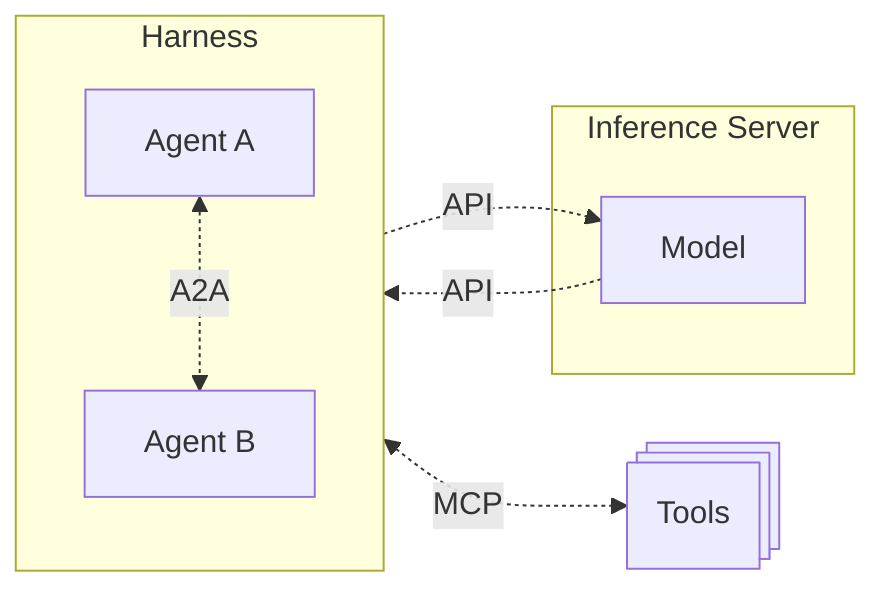
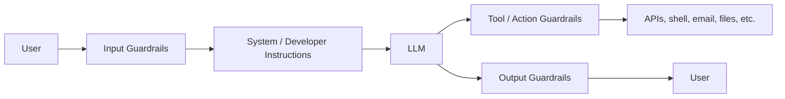

<!-- _class: lead -->
# AI Application Stack Overview

## A TLDR Intro to AI CyberInfrastructure

### By: Erick McGhee

https://github.com/mcgheee/AI_02H

---

# Terms

- **Harness** - The application that allows users or other software to interact with AI models. 
- **Agent** - A special type of harness that operates on a loop.
- **Context** - What is stored in the model's working memory.
- **Memory** - Durable long term storage of data
- **Prompt** - A single instruction or question to the model.
- **Turn** - A single response in a conversation from either the client or the model.
- **Inference** - The process of generating a response from the model.

---

# AI Stack Simplified

---

# Model Anatomy

- **Config:** structural settings needed to instantiate the model
- **Tokenizer:** converts text to tokens and tokens back to text
- **Weights:** Learned paramter values

---

# Model Types

- LLMs
  - Ex: GPT 6, Claude 5, Grok 4
- Diffusion
  - Ex: Stable Diffusion, DALL-E, LTX
- Classification / Decision
  - Ex: Jev, Laya

---

# Inference Server

- Loads and serves the model
- Schedules requests and manages batching
- Manages CPU/GPU/accelerator resources

---

# Harness

- Basically any app used to interact with AI
  - Web Chat
  - CLI
  - Agentic

---

# Agents

- A type of Harness
- Operates on a loop until conditions are met
- May provide or connect to tools

> **Examples:** Openclaw, Hermes, OpenCode, Codex, Claude Code

---

# Tools

- May be provided by the harness
  - Ex: Read, Write, Execute
-  Or, connected to an external service via MCP
  - Ex: Web scraping, Memory, Computer Use

---

# Skills

- Provide instructions, **not** capabilities
- Written in natural language
- Usually structured in Markdown
<!--
Intended to make process repeatable - largely irrelevant for frontier models
-->

---

# Context

- Model's working memory
- Limited in Size
- Lossy due to compaction
<!-- Compaction handled by Harness, not model itself -->

---

# Application Workflow

```mermaid
flowchart LR
  Client
  subgraph Harness["Harness"]
    direction TB
    h_man["Manage Conversations & Context"]
    h_sp["System Prompt"]
    h_tls["Tool Calls & Results"]
    h_lp["Agent Loop"]
  end
  subgraph Gateway
    direction TB
    g_a["Authentication / Authorization"]
    g_r["Route / Load Balance"]
    g_l["Rate Limit & Quotas"]
  end
  subgraph Server["Inference Server"]
    direction TB
    s_l["Load Model"]
    s_s["Schedule Requests"]
    s_m["Manage Resources"]
  end
  subgraph Model["Model"]
    direction TB
    m_p["Process tokens"]
    m_r["Reasoning"]
    m_g["Generate Response"]
  end
  Client -. Request .-> Harness
  Harness -. API .-> Gateway
  Gateway -. API .-> Server
  Server --> Model
```

---

# Request Path Demo

[Open Demo](request-walkthrough.html)

---

# Guardrails

- Constrains what a model can accept, produce, or do
- Soft constraints that guide the model's behavior
  - System / Developer Instructions, Training, Prompt
- Hard constraints that prevent action
  - Sandboxing, Permission Gating, Human Approval

---

# Security

- Misalignment
- Escaping containment
- Prompt injection (llms.txt)
- Backdoors (Weight & Data Poisoning)
- Supply Chain

<!--
data poisoning: corrupting the training set, so the model learns the correlation during training

weight poisoning: directly editing parameters which modifies weights without touching the data pipeline at all

supply chain: Model files, registries & hubs, tools, skills, harnesses, extentions
-->

---

# Prompt Engineering (~~is~~ ~~isn't~~ dead)

- Natural Language, Spec Driven
- Loop Engineering vs. Graph Engineering
- RuleEvolve
- Skill Distillation
- Adversarial Councils & Interviews

> Source: [Agent Harness Engineering vs. Loop Engineering vs. Graph Engineering", by: Gal Levinshtein](https://www.linkedin.com/pulse/agent-harness-engineering-vs-loop-graph-gal-levinshtein-9ma3c)

<!--
Loop engineering ex: Gauntlet Loops
Graph Engineering: Wiring Loops together as state machines
RuleEvolve: An AI generates competing system prompts for another agent, evals benchmarks, retains successful variants
Skill Distillation: Give an agent past execution logs & have it identify recurring mistakes and derive improved instructions.
Adverarial Councils: multiple models evaluate a result, critique one another's findings, reconcile disagreements (not new, but having a resurgence)
Adversarial Interviews: Instead of prompting a build, have the agent interview you first to challenge assumptions, identify contradictions, uncover edge cases, and discover requirements you haven't considered.

-->

---

# Current Trends

- Software Factories
- Reverse Engineering
- Text to Video
- Small on-device / edge models
- Decision / Classification models
- Computer Use
- Custom hardware - chips / memory / networking
